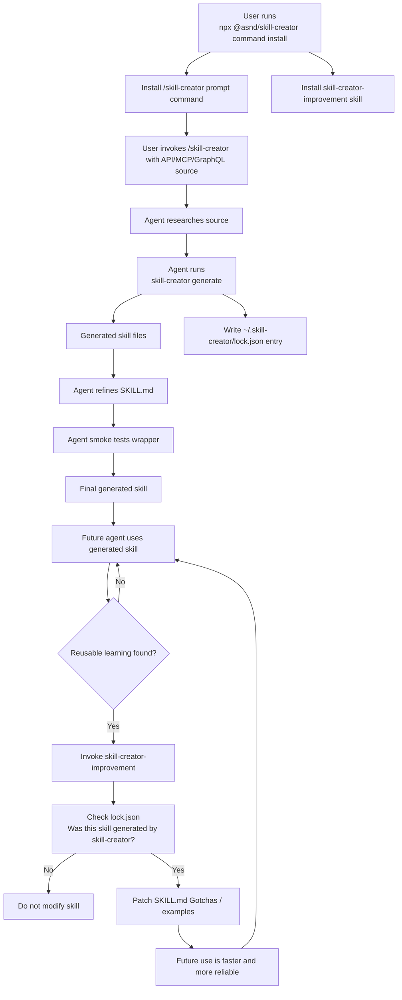

# skill-creator


Give an AI agent a link to an OpenAPI spec, GraphQL schema, or MCP server and get back a ready-to-use Agent Skill with wrapper scripts, references, and usage notes.

Instead of pasting API docs into every chat, install one slash command and let your agent create reusable command-line skills for the tools your team uses.

## Install

Install the `/skill-creator` command and companion improvement skill with `npx`:

```bash
npx @asnd/skill-creator command install --agent pi --scope global
```

This installs:

```txt
~/.pi/agent/prompts/skill-creator.md
~/.pi/agent/skills/skill-creator-improvement/
```

For a project-local command and improvement skill:

```bash
npx @asnd/skill-creator command install --agent pi --scope project
```

Skip the companion skill if you only want the prompt command:

```bash
npx @asnd/skill-creator command install --agent pi --scope global --no-improvement-skill
```

Other supported agents include `claude-code`, `codex`, `cursor`, `opencode`, `gemini-cli`, `github-copilot`, `cline`, and `windsurf`.

```bash
npx @asnd/skill-creator command install --agent claude-code --scope project
```

## Use it

Open your agent and run `/skill-creator` with the source you want to turn into a skill.

```txt
/skill-creator https://example.com/openapi.json
```

That is the normal flow: provide the spec/server/schema link, answer any missing install questions, and the agent creates the skill for you.

More examples:

```txt
/skill-creator --spec https://example.com/openapi.json --name youtube --agent pi --scope project
/skill-creator --graphql https://api.example.com/graphql --graphql-schema https://example.com/schema.graphql --name pokeapi
/skill-creator --mcp https://mcp.example.com/mcp --name context7
/skill-creator --mcp-stdio "npx -y @example/mcp-server" --name example-mcp
```

## What it creates

A generated skill looks like this:

```txt
.pi/skills/youtube/
├── SKILL.md
├── scripts/
│   └── youtube
└── references/
    └── openapi-spec-MM-DD-YYYY.json
```

Future agents can then use simple commands instead of reading API docs from scratch:

```bash
./scripts/youtube commands list
./scripts/youtube commands search videos
./scripts/youtube commands help <command>
./scripts/youtube run --pretty <command> <flags>
```

Generated scripts use `npx -y @asnd/skill-creator` internally, so consumers do not need a global install.

## Skill improvement loop

Generated skills are tracked in `~/.skill-creator/lock.json`. The companion `skill-creator-improvement` skill helps agents improve generated skills during real use. When the agent discovers a reusable gotcha, custom field, corrected command pattern, or faster workflow, it updates the generated skill's `## Gotchas` section directly.

The improvement skill only works on skills tracked in the lock file, so it avoids touching skills that were not generated by `skill-creator`.



## Shell usage

If you want to generate a skill directly from the shell or CI, use the same package with `npx`:

```bash
npx @asnd/skill-creator generate \
  --template openapi \
  --name youtube \
  --spec https://example.com/openapi.json \
  --agent pi \
  --scope project
```

GraphQL and MCP are supported too:

```bash
npx @asnd/skill-creator generate \
  --template graphql \
  --name pokeapi \
  --graphql https://api.example.com/graphql \
  --graphql-schema ./schema.graphql \
  --agent pi \
  --scope project

npx @asnd/skill-creator generate \
  --template mcp-http \
  --name context7 \
  --mcp https://mcp.example.com/mcp \
  --agent pi \
  --scope project
```

## Why use it?

- One command turns API sources into reusable agent skills.
- Specs and schemas are saved as references, so future runs are reproducible.
- Wrapper scripts expose discoverable commands with `commands list`, `commands search`, and `commands help`.
- Secrets stay in environment variables or files, not in generated docs.
- Future agents get focused instructions, gotchas, and safe usage patterns instead of a giant pasted spec.
