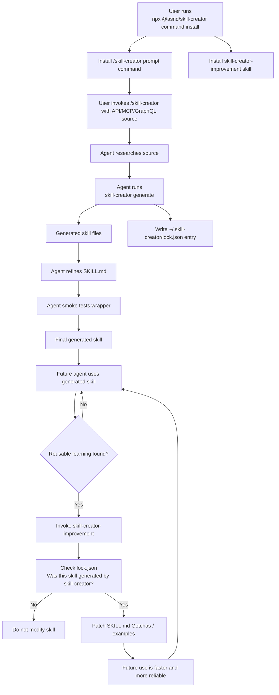
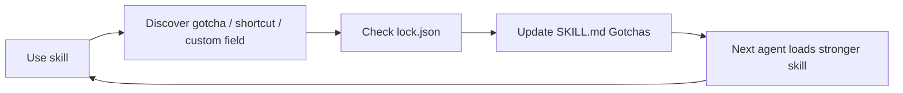

# skill-creator improvement loop plan

## Goal

Make generated skills improve over time from real usage, while avoiding accidental edits to skills that were not created by `skill-creator`.

When users install the `/skill-creator` command, they should also get a companion improvement skill. Generated skills should be tracked in a lock file. During future work, the agent can use the companion skill to add concise, verified learnings directly to the generated skill's `## Gotchas` section.

## Install behavior

When the user runs:

```bash
npx @asnd/skill-creator command install --agent pi --scope global
```

install both:

```txt
~/.pi/agent/prompts/skill-creator.md
~/.pi/agent/skills/skill-creator-improvement/SKILL.md
```

For project scope:

```bash
npx @asnd/skill-creator command install --agent pi --scope project
```

install:

```txt
.pi/prompts/skill-creator.md
.pi/skills/skill-creator-improvement/SKILL.md
```

Add an opt-out flag:

```bash
npx @asnd/skill-creator command install \
  --agent pi \
  --scope global \
  --no-improvement-skill
```

Custom command installs should not install the improvement skill by default. The companion skill should be installed only for the default bundled `/skill-creator` command.

## Mermaid overview



Neural-loop view:



Core idea:

```txt
experience -> gotcha -> SKILL.md mutation -> stronger future behavior
```

## Lock file

Add:

```txt
~/.skill-creator/lock.json
```

Purpose: track only skills created or managed by `skill-creator`, so the improvement skill never edits unrelated user/bundled/third-party skills.

Use `SKILL_CREATOR_HOME` as a test/config override. Default:

```txt
~/.skill-creator
```

Minimal shape:

```json
{
  "version": 1,
  "skills": {
    "pi:global:jira": {
      "name": "jira",
      "agent": "pi",
      "scope": "global",
      "path": "/Users/alex/.pi/agent/skills/jira",
      "script": "jira",
      "template": "openapi",
      "createdAt": "2026-05-25T00:00:00.000Z",
      "updatedAt": "2026-05-25T00:00:00.000Z"
    }
  }
}
```

Lock key format:

```txt
<agent>:<scope>:<skill-name>
```

Examples:

```txt
pi:global:exa
pi:project:jira
claude-code:project:github-api
```

## Lock file implementation

Create a small module, likely:

```txt
src/skills/lock.ts
```

API:

```ts
type SkillCreatorLock = {
  version: 1;
  skills: Record<string, ManagedSkillEntry>;
};

type ManagedSkillEntry = {
  name: string;
  agent: string;
  scope: 'project' | 'global';
  path: string;
  script?: string;
  template?: string;
  createdAt: string;
  updatedAt: string;
};

function skillKey(agent: string, scope: string, name: string): string;
function skillCreatorHome(): string;
function readLock(): Promise<SkillCreatorLock>;
function writeLock(lock: SkillCreatorLock): Promise<void>;
function upsertManagedSkill(
  entry: Omit<ManagedSkillEntry, 'createdAt' | 'updatedAt'>,
): Promise<void>;
```

Rules:

- Create `~/.skill-creator` as needed.
- Create lock file lazily.
- Preserve `createdAt` when updating an existing entry.
- Always update `updatedAt` on successful regeneration.
- Write lock only after generation and smoke test succeed.

## Generated skill changes

Every generated `SKILL.md` should include a `## Gotchas` section in the hot path.

Initial text:

```md
## Gotchas

No gotchas learned yet. When real usage reveals stable custom fields, service quirks, faster command patterns, or corrected examples, update this section directly.
```

For generated MCP scaffolds, keep the stronger placeholder already planned:

```md
## Gotchas

Replace this scaffold section after smoke testing with concise source-specific quirks, such as required project files, default registry names, path normalization, auth/runtime requirements, known upstream tool output bugs, or which helper tool returns the real install command. Remove this section if there are no gotchas.
```

The agent should update this section directly when it learns something reusable.

Examples:

```md
## Gotchas

- `Severity` is `customfield_10112`; allowed values are `P0`, `P1`, `P2`, `P3`.
- Jira create/update payloads require custom field IDs, not display names.
- Fast bug flow: confirm project key -> use known field IDs -> create issue -> fetch issue by key.
```

```md
## Gotchas

- Use `@shadcn` as the registry name unless the project defines others.
- `search-items-in-registries` may print `Add command: [object Promise]`; use `get-add-command-for-items` for the real install command.
```

## Built-in improvement skill

Add:

```txt
skills/skill-creator-improvement/SKILL.md
```

Frontmatter:

```md
---
name: skill-creator-improvement
description: Improve skill-creator generated skills when real usage reveals gotchas, custom fields, faster workflows, corrected command examples, or safer usage patterns.
---
```

Responsibilities:

1. Use proactively after using a generated skill and discovering reusable knowledge.
2. Identify the skill directory that was used.
3. Check `~/.skill-creator/lock.json`.
4. Only continue if the skill path/name is tracked by `skill-creator`.
5. Read the target `SKILL.md`.
6. Add concise verified learnings to `## Gotchas`.
7. Update verified examples or usage rules only when needed.
8. Smoke test changed command examples when practical.
9. Never edit skills not tracked in the lock file.

Editing rules:

- Keep `SKILL.md` concise.
- Add only reusable, verified learnings.
- Do not add secrets, tokens, raw API responses, huge outputs, or one-off task details.
- Do not rewrite the whole skill unless necessary.
- Prefer short bullets in `## Gotchas`.
- Ask before changing destructive workflows, auth behavior, source URLs, or install scope.

## Command installer changes

In `src/commands/install.ts`:

- Add option `--no-improvement-skill`.
- Detect whether install is for the default bundled `/skill-creator` command.
- If default bundled command and not opted out, install `skill-creator-improvement` as a skill too.
- Print both command and skill install results.

Expected output:

```txt
Installed command: skill-creator
Installed skill: skill-creator-improvement
Agent: pi
Scope: global
Path: /Users/alex/.pi/agent/prompts
Skill path: /Users/alex/.pi/agent/skills
```

For custom command source:

```bash
npx @asnd/skill-creator command install --source ./review.md --agent pi --scope global
```

install only the command.

## Skill installer helper

Create or add helper for bundled skill installation, likely in:

```txt
src/skills/install.ts
```

Function:

```ts
installBundledSkill({
  skillName: 'skill-creator-improvement',
  agent,
  scope,
  force,
});
```

Behavior:

- Resolve target dir with `resolveAgentSkillDir(agent, scope)`.
- Copy bundled skill directory recursively.
- Validate skill name.
- If target exists:
  - overwrite with `--force`, or
  - leave existing skill in place and report it already exists.

Need to map command agents to skill agents. If an agent supports command installation but not skill installation, install command only and warn. Pi supports both.

## Package changes

Update `package.json` files list:

```json
"files": [
  "dist",
  "prompts",
  "skills",
  "LICENSE",
  "README.md"
]
```

Keep `pi.prompts` as-is for now. Do not add `pi.skills` unless we want Pi package metadata to auto-install bundled skills outside our CLI flow.

## README updates

Update install section to say command install installs both:

```txt
/skill-creator prompt command
skill-creator-improvement companion skill
```

Add paths:

```txt
~/.pi/agent/prompts/skill-creator.md
~/.pi/agent/skills/skill-creator-improvement/
```

Add opt-out docs:

```bash
npx @asnd/skill-creator command install \
  --agent pi \
  --scope global \
  --no-improvement-skill
```

Add improvement-loop section:

```md
## Skill improvement loop

Generated skills are tracked in `~/.skill-creator/lock.json`.

The companion `skill-creator-improvement` skill helps agents improve generated skills during real use. When the agent discovers a reusable gotcha, custom field, corrected command pattern, or faster workflow, it updates the generated skill's `## Gotchas` section directly.

The improvement skill only works on skills tracked in the lock file, so it avoids touching skills that were not generated by `skill-creator`.
```

Include the Mermaid overview diagram.

## Tests

Add/update tests.

### Command install tests

- Default bundled command install creates prompt command and improvement skill.
- Custom command source does not install improvement skill.
- `--no-improvement-skill` skips companion skill.
- Output mentions installed skill when installed.

### Lock file tests

- `generate` writes a lock entry after success.
- `generate --force` updates existing lock entry while preserving `createdAt`.
- `SKILL_CREATOR_HOME` redirects lock file in tests.

### Generated skill tests

- OpenAPI generated `SKILL.md` includes `## Gotchas`.
- GraphQL generated `SKILL.md` includes `## Gotchas`.
- MCP generated `SKILL.md` includes `## Gotchas` and verified examples scaffold.

## Validation

Run:

```bash
pnpm fmt
pnpm typecheck
pnpm test
pnpm lint
pnpm fmt:check
pnpm build
```

Then reinstall global Pi command and companion skill:

```bash
node dist/cli/main.js command install --agent pi --scope global --force
```

Expected files:

```txt
~/.pi/agent/prompts/skill-creator.md
~/.pi/agent/skills/skill-creator-improvement/SKILL.md
```

## Out of scope for first pass

Do not implement yet:

- full usage telemetry
- CLI invocation logs
- automatic curator
- stale/archive states
- backup/rollback
- consolidation of skills
- background model review

These can come later after the basic improvement loop proves useful.
